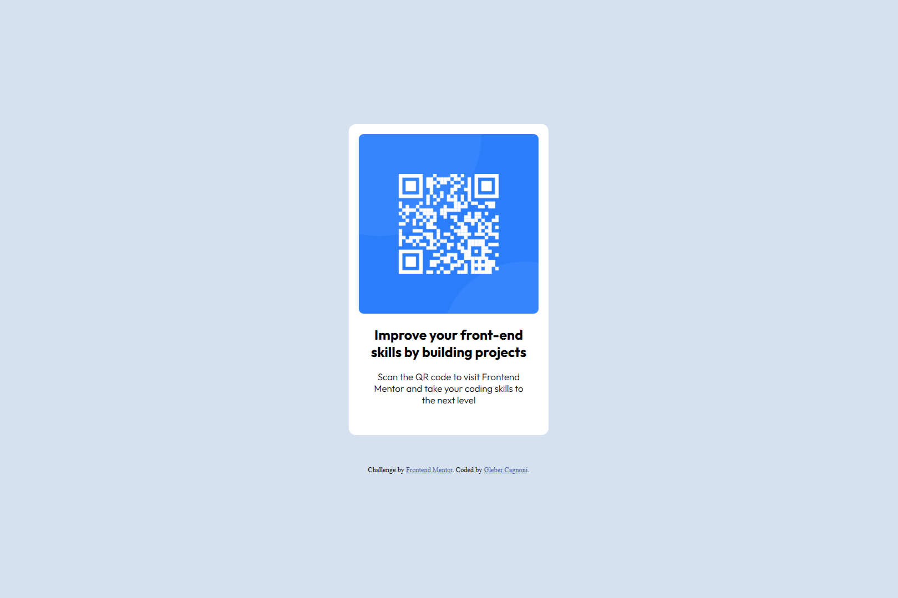

# Frontend Mentor - QR code component solution

This is a solution to the [QR code component challenge on Frontend Mentor](https://www.frontendmentor.io/challenges/qr-code-component-iux_sIO_H). Frontend Mentor challenges help you improve your coding skills by building realistic projects. 

## Table of contents

- [Overview](#overview)
  - [Screenshot](#screenshot)
- [My process](#my-process)
  - [Built with](#built-with)
  - [What I learned](#what-i-learned)
  - [Continued development](#continued-development)
- [Author](#author)


## Overview

### Screenshot




## My process

### Built with

- Semantic HTML5 markup
- CSS custom properties
- Flexbox
- CSS Grid
- Mobile-first workflow


**Note: These are just examples. Delete this note and replace the list above with your own choices**

### What I learned

I learned to use tags for a better layout. I encapsulated some elements of the HTML page in more semantic tags and improved the structural layout of the page.

Exemples:

```html


    <h1 class="title">Improve your front-end skills by building projects</h1>


    <h2 class="imperative">Scan the QR code to visit Frontend Mentor and take your coding skills to the next level</h2>
```
```css
body {
    background-color: #D5E1EF;
    width: 1440px;
    height: 960px;
    display: flex;
    justify-content: center;
    flex-direction: column;
    align-items: center;


}

main {
    background-color: #fff;
    width: 320px;
    height: 499px;
    padding: 16px 16px 40px 16PX;
    border-radius: .7rem;
    display: flex;
    justify-content: center;
    flex-direction: column;
    align-items: center;

}

#QR {
    width: 288px;
    height: 288px;
    border-radius: .5rem;
    display: flex;
    justify-content: center;
}
```


### Continued development

My goals are to continue learning about HTML structures and CSS selectors, and in the future, learn JavaScript.


## Author

- Website - [Gleber Cagnoni](https://www.your-site.com)
- Frontend Mentor - [@yGleberC](https://www.frontendmentor.io/profile/yourusername)


